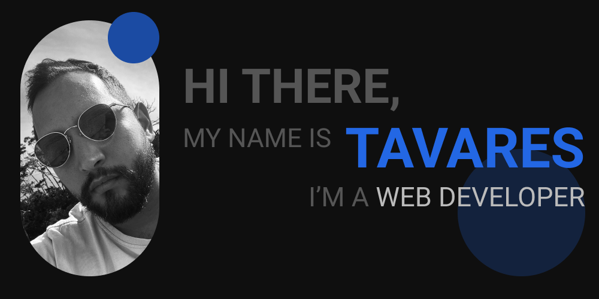

#

# A Little Bit About Me...

I'm a web developer on the lookout for that first amazing job in the industry!
I've put in the hard work, honed my coding skills, and now it's time to showcase what I'm made of. I've got a portfolio filled with my coolest projects, and my passion for web development drives everything I do.

The web development world excites me, and I'm ready to rock my dream job with my coding prowess!

#

# My Websites

### [Web Development Portfolio ](https://webdev.thiagotavares.com/)

You'll find my most recent projects [here.](https://webdev.thiagotavares.com/)

### [Creative Portfolio](https://thiagotavares.com/)

My [Creative Portfolio](https://thiagotavares.com/) is getting old, but it was my first big challenge on web development. And I'll admit that a lot can be improved on the code I used here, however that only proves me that all my efforts are making a huge difference on my skills level up.

#

# Skill Set

#### CODING :.

 &nbsp;&nbsp;&nbsp; Git &nbsp;&nbsp;&nbsp;
&nbsp;&nbsp;&nbsp; GitHub &nbsp;&nbsp;&nbsp;
&nbsp;&nbsp;&nbsp; VS Code &nbsp;&nbsp;&nbsp;

##

#### WEB DEVELOPMENT :.

&nbsp;&nbsp;&nbsp; Javascript &nbsp;&nbsp;&nbsp;
&nbsp;&nbsp;&nbsp; HTML &nbsp;&nbsp;&nbsp;
&nbsp;&nbsp;&nbsp; CSS &nbsp;&nbsp;&nbsp;
&nbsp;&nbsp;&nbsp; SASS &nbsp;&nbsp;&nbsp;
&nbsp;&nbsp;&nbsp; React &nbsp;&nbsp;&nbsp;

##

#### THINGS I HAVE SOME KNOWLEDGE :.

&nbsp;&nbsp;&nbsp; Wordpress &nbsp;&nbsp;&nbsp;
&nbsp;&nbsp;&nbsp; Shell Script &nbsp;&nbsp;&nbsp;

##

# Some Projects
